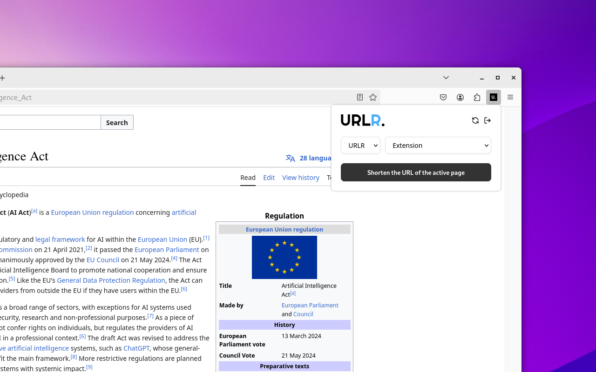
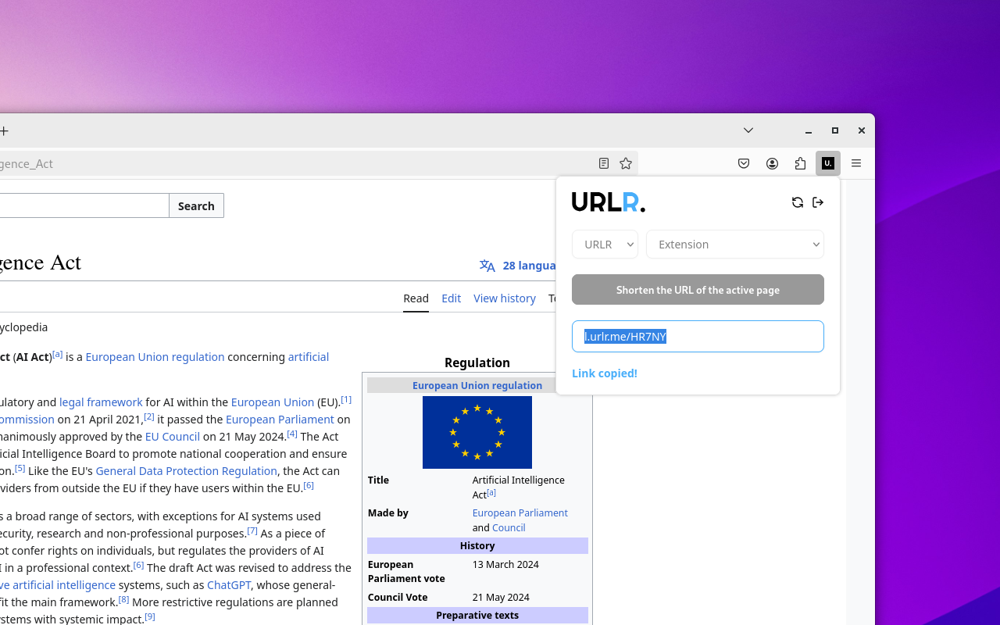

# urlr-webextension

This is the official webextension to easily reduce your links with [urlr.me/en](https://urlr.me).

## Screenshots

## Installation instructions

### Mozilla Firefox

    
### Google Chrome based browsers

## Build instructions

Install dependencies:

`npm install`

And then, run:

`npm run build`

## License

MIT

**Free Software, Hell Yeah!**
